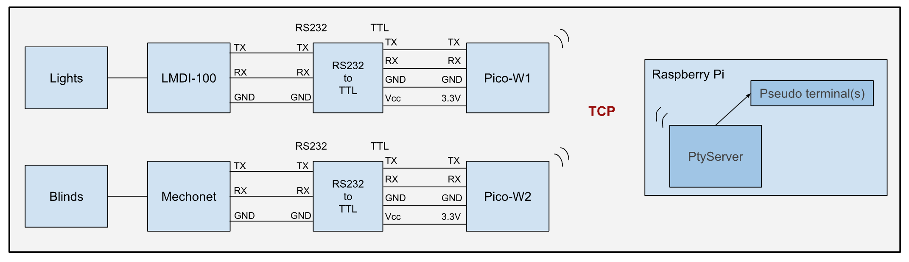

# About
Ever need a serial port far away from your Raspberry Pi? Wish you could use WiFi to talk to a serial device without having to run a wire? This project is for you.

## Install for use
```
# npm install -g RemoteSerialPico
# RemoteSerialPico install
```

Now a server is running on the PI. If you plug in a pico to the USB it will install the client code on the pico and make it a remote serial port.

`/tmp/pico_1`

It's that easy to setup a remote serial port.  Each time you plug in a pico, it will be the next pico_N on the list.

## Background
It enables communication between TCP networks and UART devices through a Raspberry Pi Pico-W. This project can be extended using either the [`node-red-bridge`](https://github.com/RajkumarGara/node-red-bridge) or [`homebridge-tcp-smarthome`](https://github.com/RajkumarGara/homebridge-tcp-smarthome).

## Installation for Development
* Install nodejs latest version (should be atleast v20.11.1) on Raspberry Pi, following the steps on [install-nodejs](https://github.com/nodejs/help/wiki/Installation#how-to-install-nodejs-via-binary-archive-on-linux).
* Install `rshell` on Raspberry Pi.
    ```
    sudo pip3 install rshell --break-system-packages
    ```

## Running the setup
* Open terminal on your Raspberry Pi and enter below commands to clone this github repo.
    ```
    cd ~
    git clone https://github.com/RajkumarGara/RemoteSerialPico
    ```
* Create a udev rule that triggers on USB Pico connection. 
    ```
    cd ~/RemoteSerialPico/src
    sudo cp 99-pico.rules /etc/udev/rules.d/
    ```
* Reload Udev rules to apply the changes
    ```
    sudo udevadm control --reload-rules
    sudo udevadm trigger
    ```
* Run `PtyServer.js` code
    ```
    node PtyServer.js
    ```
* Connect your Pico-W to the Raspberry Pi. This will automatically install [`PicoSerialClient.py`](./src/PicoSerialClient.py) on the Pico-W.
* When using multiple Pico-W devices for your project, ensure that each one is assigned a unique `PICO_ID` in  [`config.json`](./src/config.json), then reconnect the Pico.

## Pico on-board LED status
* LED blinks repeatedly during the WiFi connection process. Upon successful connection it turns off.
* LED switches on again when connected to the TCP server.
* LED blinks once upon receiving a command either from TCP server or a serially connected device.
* LED turns off when disconnected from the TCP server.

## Developer Notes
* **PtyServer features:-**
    * Detects Pico clients using `pico_{N}` format, and assigns separate pipes.
    * Sends data available in command pipe to the respective Pico and clears the pipe.
    * Writes data received from Pico into corresponding response pipe.
    * Deletes corresponding Pico pipes upon disconnection.

* **PicoScriptDeployer features:-**
    * Automtically obtains `wifi-ssid, password, IP` and updates [`config.json`](./src/config.json), if not you can manually update it.
    * Modifies [`PicoSerialClient.py`](./src/PicoSerialClient.py) with the credentials from [`config.json`](./src/config.json).
    * Renames PicoSerialClient.py as main.py and then deploys it to ensure Pico runs the code after power-on reset.
    * Deploys [`PicoSerialClient.py`](./src/PicoSerialClient.py) to the most recently connected Pico only, if multiple Picos are attached to Pi.

## Visual Overview
* This diagram provides a general overview of the project.
    

* Below diagram depicts Raspberry Pi Pico-W units interfacing with devices for TCP to UART communication.
    

## Credits
Special thanks to [Medical Informatics Engineering](https://www.mieweb.com/) for their support throughout the development of this project, especially to [Doug Horner](https://github.com/horner) for his invaluable guidance.
