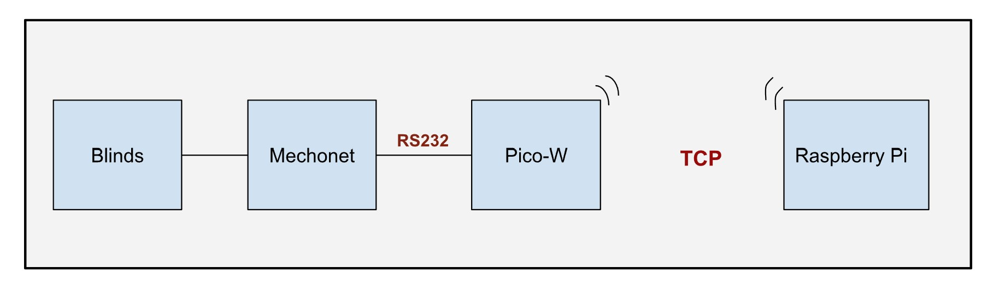

# About
Every need a serial port far away from your raspberry pi?  Wish you could use the WIFI to talk to a serial device without having to run a wire?  This project is for you.

# Install for use

```
# npm install -g pico-network-serial-port
# pico-network-serial-port install
```

Now a server is running on the PI.  If you plug in a pico to the USB it will install the client code on the pico and make it a remote serial port.

`/tmp/ttyp1`

It's that easy to setup a remote serial port.  Each time you plug in a pico, it will be the next ttypN on the list.

# Background

This project enables communication between TCP networks and UART devices through a Raspberry Pi Pico-W. It's designed for IoT applications, providing a bridge for data exchange between network protocols and serial devices. This project represents the second part, completing either the [`node-red-bridge`](https://github.com/RajkumarGara/node-red-bridge) or [`homebridge-tcp-smarthome`](https://github.com/RajkumarGara/homebridge-tcp-smarthome) projects.

## PtyServer features
1. **Pico Identification and Pipe Management:** Automatically identifies Pico clients upon connection using a specific identifier format (pico_{number}), creating distinct command and response pipes for each.
2. **Command Dispatching:** Watches for changes in command pipes, sending new commands to the respective Pico, and clears the pipe post-send to ready it for next commands.
3. **Response Logging:** Records data received from Picos into their dedicated response pipes, facilitating external access to Pico responses.
4. **Debounce Mechanism:** Implements a debounce strategy to prevent duplicate command processing and transmission due to rapid pipe modifications.
5. **Cleanup on Disconnection:** Cleans up resources by closing connections, stopping pipe watchers, and deleting Pico-specific pipes upon disconnection.

## Installation for Development
* Install nodejs latest version (should be atleast v20.11.1) on Raspberry Pi, following the steps on [install-nodejs](https://github.com/nodejs/help/wiki/Installation#how-to-install-nodejs-via-binary-archive-on-linux).

## Running the setup
* Go to terminal on your Raspberry Pi and enter below command to clone this github repo (it clones to home directory. You can create a new folder and clone it there if you want).
    ```bash
    cd ~
    git clone https://github.com/RajkumarGara/pico-network-serial-port
    ```
* Navigate to `/pico-network-serial-port/src` folder and run `PtyServer.js`
    ```bash
    cd ~/pico-network-serial-port/src
    node PtyServer.js
    ```
* Follow any one of the two steps to run **PicoSerialClient** on Pico-W:
    1. Connect your Pico-W to the Raspberry Pi or laptop and manually run [`PicoSerialClient.py`](./src/PicoSerialClient.py) in thonny (follow the steps in [get-started-pico-w](https://projects.raspberrypi.org/en/projects/get-started-pico-w/1)), make sure to initialize the `WIFI_SSID`, `WIFI_PASSWORD`, `IP_ADDRESS` with the exact credentials on lines 7, 8, 11 before running the code.
    2. Use [PicoScriptDeployer](https://github.com/RajkumarGara/PicoScriptDeployer) to update the Wi-Fi credentials in [`PicoSerialClient.py`](./src/PicoSerialClient.py) and deploy the code subsequently.
* If you're using multiple Pico-W devices, make sure to assign a unique `PICO_ID` to each one manually on line 15 of the [`PicoSerialClient.py`](./src/PicoSerialClient.py) before running the code.

## Pico on-board LED status
* The LED blinks repeatedly during the WiFi connection process. Once successfully connected, the LED switches off.
* Upon successful connection to the TCP server, the LED switches on.
* Whenever a command is received either from the TCP server or from a serially connected device, the LED blinks once.
* When disconnected from the TCP server, the LED turns off.

## Visual Overview
Below diagram depicts Raspberry Pi Pico-W units interfacing with devices for TCP to UART communication.
    

## Credits
Special thanks to [Medical Informatics Engineering](https://www.mieweb.com/) for their support throughout the development of this project, especially to [Doug Horner](https://github.com/horner) for his invaluable guidance.
